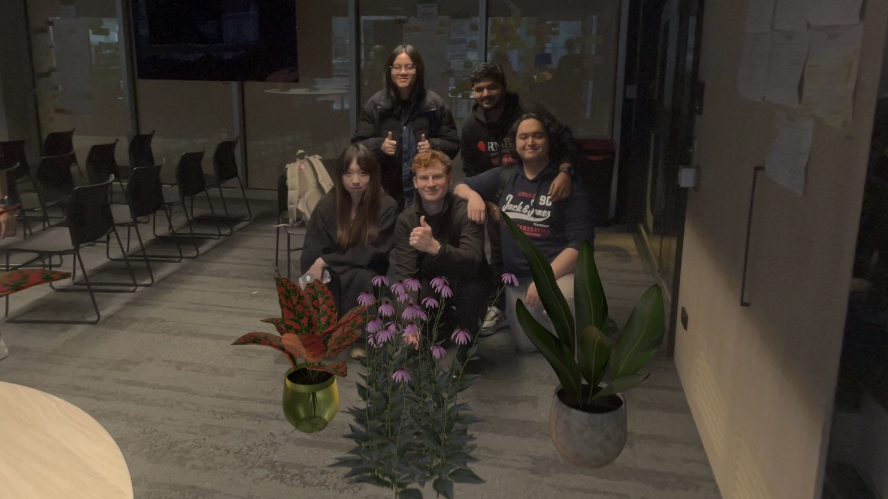

# BeeMyGarden

## Table of Contents
* [General info](#general-info)
* [Technologies](#technologies)
* [Authors](#authors)

## General Info
BeeMyGarden is an Apple Vision Pro app that helps users plan their ideal garden with a focus for accommodating native Australian bees.

Created as part of the [Apple Foundation Program](https://www.rmit.edu.au/study-with-us/apple-foundation-program#about), a three week-long program at RMIT that taught and enforced skills in user research, app design, and Swift programming.

## Technologies
* Swift
* SwiftUI

## Authors
* Timothy Currie
* Mai Le
* Fuyao Yang
* Vidyasagar Agasarahalli
* Falah Rasyidi